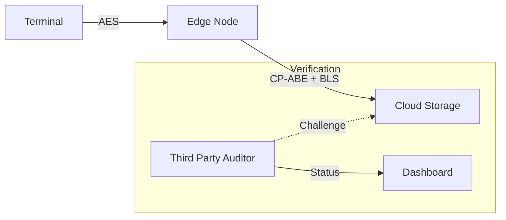

# SecureData Layer: Privacy-Preserving IoT Data Exchange

  

## 🌐 Executive Summary
**SecureData Layer** is a production-grade, distributed system designed to solve the critical challenges of data sovereignty, privacy, and integrity in the IoT-Edge-Cloud continuum.

Unlike simulations, this project implements **Real Pairing-Based Cryptography (BN128)** to ensure:
1.  **Confidentiality**: CP-ABE (Attribute-Based Encryption) ensures only authorized users can decrypt.
2.  **Integrity**: Homomorphic Signatures (BLS) allow public auditing without decryption.
3.  **Scalability**: Async Microservices architecture containerized with Docker.

### 🚀 Key Features (v2.0)
-   **Real Cryptography**: Replaced mocks with `py_ecc` for actual BLS12-381/BN128 operations.
-   **Microservices**: Fully decoupled FastAPIs for Terminal, Edge, Cloud, and TPA.
-   **Live Audit Dashboard**: Real-time visualization of the Zero-Trust integrity verification process.
-   **Hyperscale Ready**: Dockerized and orchestrated via `docker-compose`.

## 📦 Getting Started

### Prerequisites
-   Python 3.10+
-   Docker & Docker Compose (Optional for full prod deployment)

### 🏎️ Quick Demo (Local)
We have provided a unified script to spin up the entire stack (4 microservices + Frontend) and inject demo data.

```bash
# 1. Start the System
./start_demo.sh
```

This will launch:
-   **Edge Service**: `http://127.0.0.1:8000`
-   **Cloud Service**: `http://127.0.0.1:8001`
-   **TPA Service**: `http://127.0.0.1:8002`
-   **Auditor Dashboard**: `http://127.0.0.1:3000`

Use **Ctrl+C** to stop all services.

## 🏗️ Architecture

The system operates on a **Zero-Trust** model using `py_ecc` for cryptographic primitives:



### Components
1.  **Terminal**: Generates AES-encrypted telemetry.
2.  **Edge Node**:
    -   Decrypts AES.
    -   **Re-encrypts** using CP-ABE (Key Encapsulation).
    -   **Signs** using BLS Homomorphic Signature.
3.  **Cloud Storage**: Stores opaque encrypted blobs (oblivious to content).
4.  **TPA (Auditor)**: Verifies `e(sigma, g2) == e(H(m), pk)` without seeing the data.

## 📚 Documentation
-   **[Architecture Deep Dive](docs/ARCHITECTURE.md)**: Network flows and component details.
-   **[API Reference](docs/API.md)**: OpenAPI specifications for all microservices.
-   **[Security Model](docs/SECURITY.md)**: Mathematical proofs and attack analysis.
-   **[Development Guide](CONTRIBUTING.md)**: Setup and testing instructions.

## 🧪 Verification
Run the automated integration suite to verify the API flow:
```bash
python3 tests/test_api_flow.py
```
Run crypto unit tests:
```bash
python3 -m pytest tests/test_crypto.py
```
